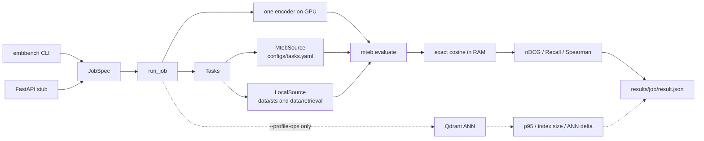
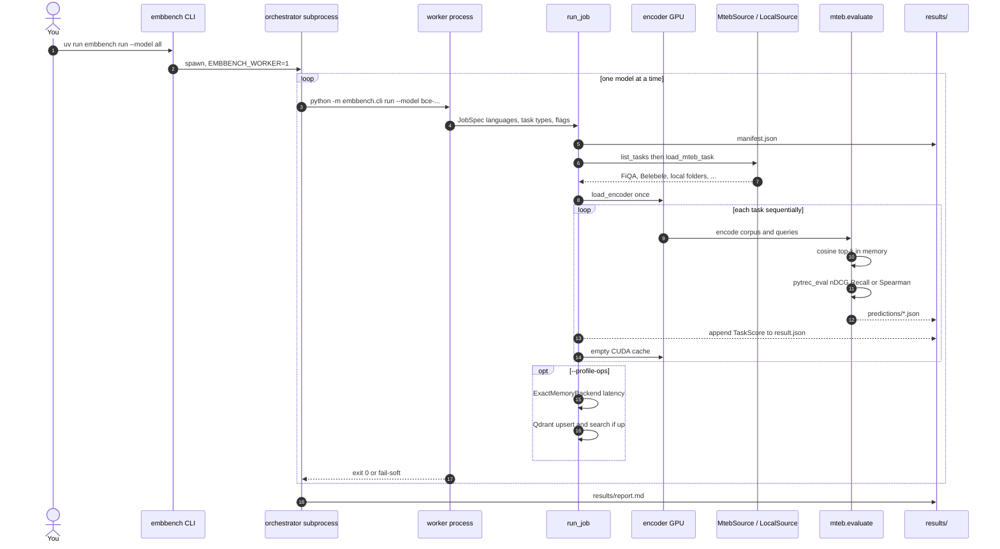
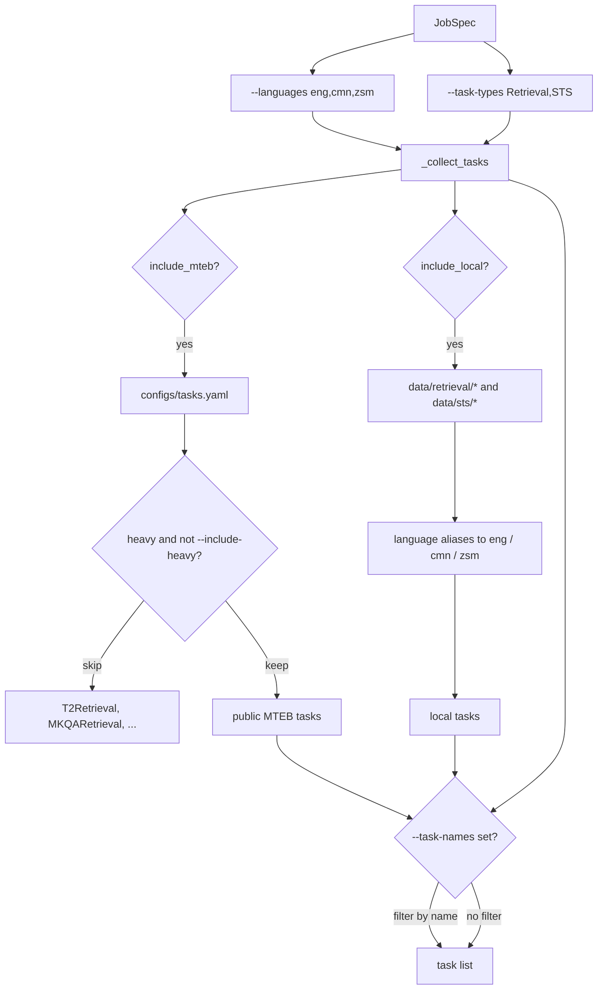
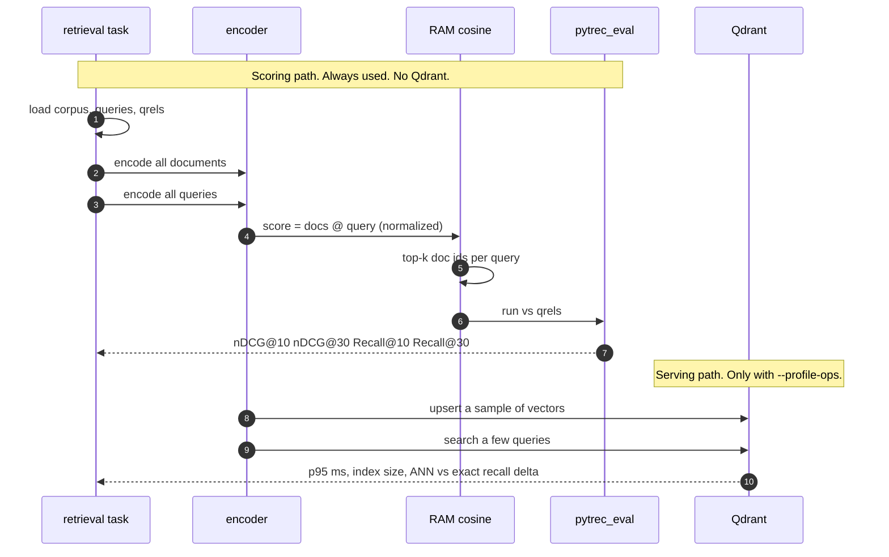
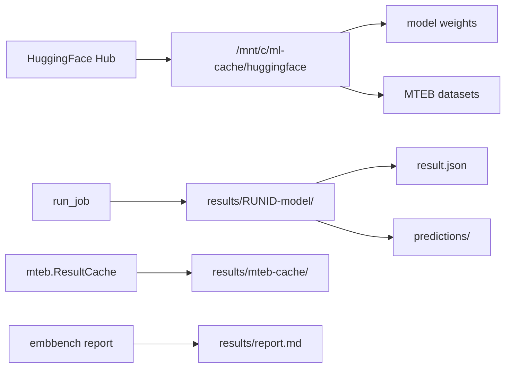

# How the benchmark runs

Quality scores (nDCG, Recall, STS Spearman) never go through Qdrant. Qdrant is optional and only used for serving-path numbers when you pass `--profile-ops`.

How to peek at the actual texts: [inspect-datasets.md](inspect-datasets.md).  
How to add your own folder: [custom-datasets.md](custom-datasets.md).

## Components

`run_job(JobSpec) -> JobResult` is the only execution path. The CLI and the API only build a spec.

## Request sequence: `embbench run`

`--model all` spawns **one subprocess per model** and waits for exit before the next, so two encoders never share the GPU.

A single `--model bce-embedding-base_v1` skips the orchestrator and calls `run_job` in the same process.

## Which datasets get loaded

Malay public tasks today: BelebeleRetrieval (`zsm`), WebFAQRetrieval (`msa`). MKQARetrieval is heavy. Malay STS is empty until you drop `data/sts/<name>/`.

## Retrieval scoring vs Qdrant

STS is the same encoder with no search: embed sentence1 and sentence2, cosine, Spearman vs the human `score`.

## Where files land

Weights and public datasets stay on the Windows drive (`HF_HOME` must start with `/mnt/c`). Job outputs stay on WSL ext4 under `results/`.
