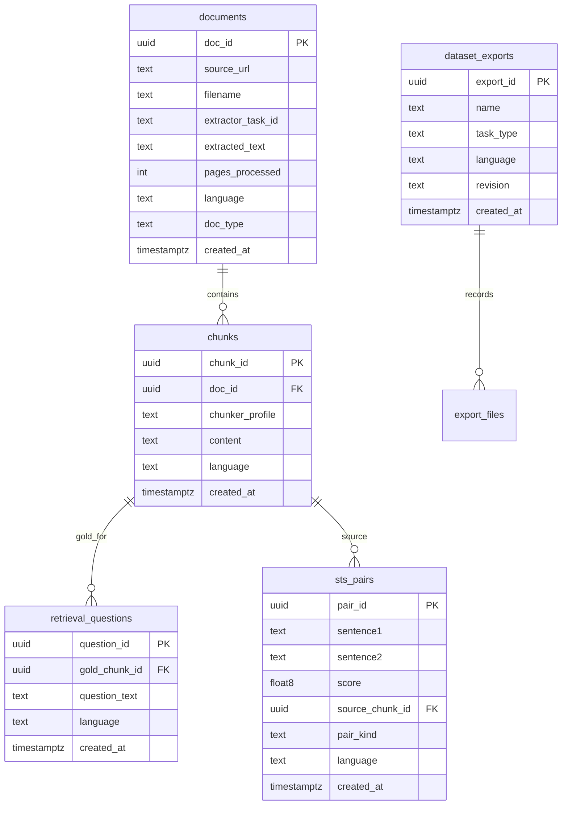

# Dataset store

Postgres for labelled benchmark text. The **document extractor is an existing service** (`http://localhost:50200`). It returns one markdown/text blob per file. This repo’s generation path (`src/embbench/generation/`) must **call it, copy the text into Postgres before TTL, chunk it, then label**. Scoring never connects here. Connection strings live in the repo `.env`.

This schema does not include a vector store. Chunk quality cleanup is deferred; STS planning still uses each row as a seed (see [sts-generation.md](sts-generation.md)).

## Current Postgres

Database name: `embbench`. Access is SSH then local `127.0.0.1:5432`. Put host, user, and password in env (`DATABASE_URL` or equivalent). **Do not commit credentials.**

Live chunker profile: `bce_500_50_min100` (~500 tokens, 50 overlap, min size 100). Example row (ids only):

| Role | Example |
|---|---|
| Chunk id | `b7bdd4aa-1135-4d10-9341-41d5ac716e6f` |
| Profile | `bce_500_50_min100` |
| Document id | `c2c80ac7-9914-4dc5-a252-0b8a3e9d32c6` |
| Language | `en` (export as `eng-Latn`) |
| Created | `2026-09-01 14:57:17 +08` |

Confirm column names against `\d chunks`. The body is markdown from the extractor (SOP letterhead, tables). STS does not require a second chunker; it reads this text as the seed.

## Pipeline

```
host file at a URL the extractor worker can GET
  → POST /extract {url, filename} → poll /status → GET /result → GET download_url
  → persist UTF-8 markdown on documents (before RESULT_TTL / presign expiry)
  → split markdown into chunks          ← we own this
  → generation (questions, STS pairs)   ← we own this; STS plan: [sts-generation.md](sts-generation.md)
  → export jsonl / tsv / meta.yaml
  → embbench
```

The extractor does not write Postgres, does not chunk, and does not keep results forever. RQ metadata lasts about **1 hour**; `download_url` is presigned (default **1 hour**). After that the JSON status is gone; copy `result.txt` into `documents.extracted_text` immediately.

## Existing extractor (do not reimplement)

Base URL default `http://localhost:50200`. No `/api/v1` prefix. Async, URL-only (no multipart upload).

| Step | Contract |
|---|---|
| Submit | `POST /extract` `{url, filename}` → **202** `{task_id}` |
| Poll | `GET /status/{task_id}` → `queued` \| `started` \| `finished` \| `failed` |
| Metadata | `GET /result/{task_id}` only when `finished` → `{download_url, pages_processed, filename}` |
| Body | `GET download_url` → UTF-8 markdown/text (`text/plain`). Not inlined in JSON |
| Cleanup | optional `DELETE /result/{task_id}` |

`filename` extension selects the parser (`.pdf` `.docx` `.pptx` `.txt` `.md` and images). The worker HTTP-GETs `url` (300s). That URL must be reachable from the **worker**, not only from this host.

What we get: one blob with `<!-- page: N/total -->`, `<!-- page-break -->`, markdown headings/tables, optional `[IMG:N]` captions. No JSON pages, no boxes, no original bytes.

What we still implement:

| Ours | Why |
|---|---|
| Put the PDF/image on object storage and pass a worker-reachable `url` | Extractor has no upload |
| Poll until `finished` / `failed`; never `/result` on `failed` | Async job |
| Fetch `download_url` from a host that matches `SEAWEEDFS_PUBLIC_URL` | Internal `seaweedfs:8333` is not reachable from every client |
| Save markdown in Postgres | Extractor TTL |
| Chunk (e.g. on page comments, headings, or token windows) | Extractor does not chunk |
| Questions / STS / export | Extractor is not a dataset API |

`GET /health` is liveness only. Empty pages or `[Extraction failed: …]` are OCR-backend issues.

## Scope

| In this database | Not in this database |
|---|---|
| Documents and chunks from the extractor | Embedding model registry |
| Retrieval questions and STS pairs | Vector payloads, Qdrant collections, point ids |
| Export name, language, revision | nDCG, Recall, Spearman, job runs, p95 latency |

Latency and repeated encode runs belong to the embedding service plus embbench (`mteb.evaluate`, `--profile-ops`). Re-running a benchmark does not require stored vectors here: each run re-encodes **text** from the exported folder.

If generation needs nearest-chunk helpers (hard negatives, STS candidates), call the embedding service for that job and discard the index. Do not persist `qdrant_point_id` on chunks.

## Schema



### documents

One row per source file. Written by **our** extractor client after `download_url` is fetched. Not scored.

| Column | Type | Notes |
|---|---|---|
| `doc_id` | uuid | Primary key |
| `source_url` | text | URL submitted to `POST /extract` |
| `filename` | text | Same as extract request; extension routing |
| `extractor_task_id` | uuid | Extractor `task_id`; audit only, not a durable FK |
| `extracted_text` | text | Full UTF-8 markdown body from `download_url` |
| `pages_processed` | int | From `/result` |
| `language` | text | `eng`, `cmn`, or `zsm` (and aliases used on export) |
| `doc_type` | text | e.g. handbook, SOP, FAQ |
| `created_at` | timestamptz | |

Do not treat extractor S3 as the source of truth. After copy, `DELETE /result/{task_id}` is optional.

### chunks

Passage text. Written by **our** chunker from `documents.extracted_text`. Page comments (`<!-- page: N/total -->`) are split hints, not required as one chunk per page. Export target: `corpus.jsonl`.

| Column | Type | Notes |
|---|---|---|
| `chunk_id` | uuid | Primary key; becomes `_id` in `corpus.jsonl` |
| `doc_id` | uuid | FK → `documents` |
| `chunker_profile` | text | e.g. `bce_500_50_min100` |
| `content` | text | Passage body; becomes `text` |
| `language` | text | DB may store `en`; export aliases to `eng` |
| `created_at` | timestamptz | |

### retrieval_questions

Written by generation after chunks exist. Export targets: `queries.jsonl` and `qrels.tsv` (`score` = 1).

| Column | Type | Notes |
|---|---|---|
| `question_id` | uuid | Primary key; becomes `_id` in `queries.jsonl` |
| `gold_chunk_id` | uuid | FK → `chunks`; qrel corpus id |
| `question_text` | text | Becomes `text` |
| `language` | text | Must match the export `meta.yaml` language |
| `created_at` | timestamptz | |

Query count is independent of chunk count. New PDFs do not create questions until generation runs on those chunks.

### sts_pairs

Written by generation. Export target: `pairs.jsonl`.

| Column | Type | Notes |
|---|---|---|
| `pair_id` | uuid | Primary key |
| `sentence1` | text | Exported as-is |
| `sentence2` | text | Exported as-is |
| `score` | float8 | Must fall in `[min_score, max_score]` in `meta.yaml` (default 0–5) |
| `source_chunk_id` | uuid | Optional FK → `chunks`; lineage only |
| `pair_kind` | text | `paraphrase` or `chunk_chunk` |
| `language` | text | |
| `created_at` | timestamptz | |

Pair text is stored on the row. A paraphrase is not a second chunk.

### dataset_exports

Ledger of frozen snapshots. Export target: `meta.yaml`.

| Column | Type | Notes |
|---|---|---|
| `export_id` | uuid | Primary key |
| `name` | text | Task id; folder name and `--task-names` |
| `task_type` | text | `retrieval` or `sts` |
| `language` | text | Value written to `meta.yaml` (`eng-Latn`, `cmn-Hans`, `zsm-Latn`) |
| `revision` | text | Cache key; change whenever exported files change |
| `created_at` | timestamptz | |

## Adding PDFs

Host the new file, run extract, persist `extracted_text`, chunk. Existing questions and STS pairs are unchanged.

| What changes | What does not |
|---|---|
| Corpus size (`chunks`) | Old `gold_chunk_id` rows, if those chunks still exist |
| Next export `corpus.jsonl` | Scores in embbench, until a new `revision` is exported and scored |
| Optional: generation on **new** chunk ids only | Automatic questions for the new PDF |

Then: generate labels for the new chunks (or skip and keep the old query set against a larger corpus), insert a new `dataset_exports` row with a new `revision`, rewrite the folder. embbench re-encodes the new snapshot. No Qdrant update in this service.

## Wipe and restart

Delete `documents` for a clean extract. Cascade `chunks`. Delete `retrieval_questions` and `sts_pairs` whose FKs break. Run extractor, then generation, then export with a new `revision`. Previous `dataset_exports` rows stay as history.

## Export

| Table | Output |
|---|---|
| `chunks` | `data/retrieval/<name>/corpus.jsonl` — `{"_id", "text"}` |
| `retrieval_questions` | `data/retrieval/<name>/queries.jsonl` — `{"_id", "text"}` |
| `retrieval_questions.gold_chunk_id` | `data/retrieval/<name>/qrels.tsv` — `question_id`, `chunk_id`, `1` |
| `sts_pairs` | `data/sts/<name>/pairs.jsonl` — `{"sentence1", "sentence2", "score"}` |
| `dataset_exports` | `meta.yaml` — `name`, `language`, `revision` |

`revision` must change when any of those files change. Unchanged revision reuses the MTEB score cache.

Retrieval and STS are separate exports. Language on `meta.yaml` must alias to the embbench `--languages` filter.

## Example flow

1. Put `handbook.pdf` on object storage at a worker-reachable URL.
2. `POST /extract` `{url, filename: "handbook.pdf"}`. Poll until `finished`.
3. `GET /result` → `GET download_url` → store markdown on `documents`.
4. Chunk `extracted_text` into `chunks`.
5. Generation writes 800 `retrieval_questions`.
6. Export `sop-handbook-v1` / revision `2026-09-01`. embbench scores the folder.

Add a second PDF: extract, persist, chunk. Generation may label only the new chunk ids. Re-export a new `revision`.

Wipe: delete the `documents` row, re-extract (new `task_id`), re-chunk, regenerate, export.

## Constraints

- Copy extractor output into Postgres before RQ TTL and presign expiry. Extractor `task_id` is not a long-term pointer.
- Chunk after persist. Extract before generate. `gold_chunk_id` / `source_chunk_id` must reference existing chunks.
- `chunks.content` and `retrieval_questions.question_text` are non-empty.
- `sts_pairs.score` is finite and within the STS `meta.yaml` range.
- `dataset_exports.name` is unique per `task_type` for a given revision.
- This database does not store embeddings. Generation-service does not write `results/` and does not own Qdrant.
