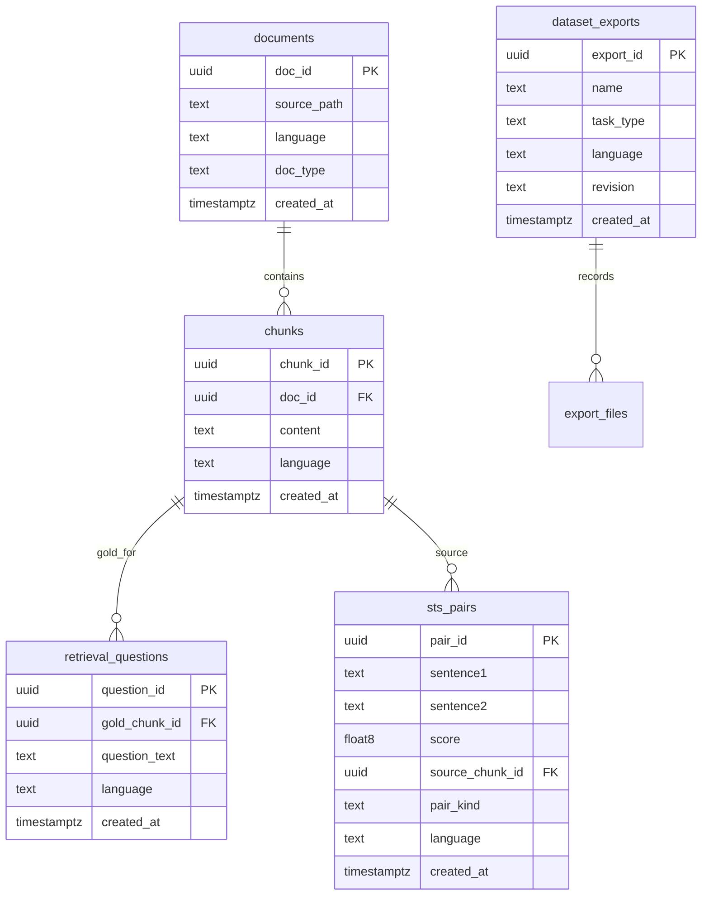

# Dataset store

Postgres schema for the generation service. The database stores source documents, chunks, retrieval questions, and STS pairs. It does not store embeddings, model registries, or benchmark scores.

embbench never connects to this database. A separate export job writes the folders described in [custom-datasets.md](custom-datasets.md).

## Scope

| In this database | Not in this database |
|---|---|
| Documents, chunks, questions, STS pairs | Embedding models (`configs/models.yaml`) |
| Export name, language, revision | Vector payloads and Qdrant point ids |
| Lineage from document to label | nDCG, Recall, Spearman, job runs |

Scoring remains `mteb.evaluate` in embbench. Serving-path metrics remain Qdrant in embbench (`--profile-ops`).

## Schema



### documents

Original files. Not scored.

| Column | Type | Notes |
|---|---|---|
| `doc_id` | uuid | Primary key |
| `source_path` | text | Origin path or URI |
| `language` | text | `eng`, `cmn`, or `zsm` (and aliases used on export) |
| `doc_type` | text | e.g. handbook, SOP, FAQ |
| `created_at` | timestamptz | |

### chunks

Passage text. Export target: `corpus.jsonl`.

| Column | Type | Notes |
|---|---|---|
| `chunk_id` | uuid | Primary key; becomes `_id` in `corpus.jsonl` |
| `doc_id` | uuid | FK → `documents` |
| `content` | text | Passage body; becomes `text` |
| `language` | text | |
| `created_at` | timestamptz | |

### retrieval_questions

Queries with a single gold passage. Export targets: `queries.jsonl` and `qrels.tsv` (`score` = 1).

| Column | Type | Notes |
|---|---|---|
| `question_id` | uuid | Primary key; becomes `_id` in `queries.jsonl` |
| `gold_chunk_id` | uuid | FK → `chunks`; qrel corpus id |
| `question_text` | text | Becomes `text` |
| `language` | text | Must match the export `meta.yaml` language |
| `created_at` | timestamptz | |

A corpus of tens of thousands of chunks does not require one question per chunk. Query count is independent of chunk count.

### sts_pairs

Sentence pairs with a similarity score. Export target: `pairs.jsonl`.

| Column | Type | Notes |
|---|---|---|
| `pair_id` | uuid | Primary key |
| `sentence1` | text | Exported as-is |
| `sentence2` | text | Exported as-is |
| `score` | float8 | Must fall in `[min_score, max_score]` in `meta.yaml` (default 0–5) |
| `source_chunk_id` | uuid | Optional FK → `chunks`; lineage only |
| `pair_kind` | text | `paraphrase` or `chunk_chunk` |
| `language` | text | |
| `created_at` | timestamptz | |

Pair text is stored on the row. A paraphrase is not a second chunk and is not a third task type. `source_chunk_id` / `pair_kind` are lineage, not MTEB fields.

### dataset_exports

One row per frozen snapshot. Export target: `meta.yaml`.

| Column | Type | Notes |
|---|---|---|
| `export_id` | uuid | Primary key |
| `name` | text | Task id; folder name and `--task-names` |
| `task_type` | text | `retrieval` or `sts` |
| `language` | text | Value written to `meta.yaml` (`eng-Latn`, `cmn-Hans`, `zsm-Latn`) |
| `revision` | text | Cache key; change whenever exported files change |
| `created_at` | timestamptz | |

## Export

| Table | Output |
|---|---|
| `chunks` | `data/retrieval/<name>/corpus.jsonl` — `{"_id", "text"}` |
| `retrieval_questions` | `data/retrieval/<name>/queries.jsonl` — `{"_id", "text"}` |
| `retrieval_questions.gold_chunk_id` | `data/retrieval/<name>/qrels.tsv` — `question_id`, `chunk_id`, `1` |
| `sts_pairs` | `data/sts/<name>/pairs.jsonl` — `{"sentence1", "sentence2", "score"}` |
| `dataset_exports` | `meta.yaml` — `name`, `language`, `revision` |

`revision` must change when any of those files change. Unchanged revision reuses the MTEB score cache.

Retrieval and STS are separate exports (separate `name` / folder). Language on `meta.yaml` must alias to the embbench `--languages` filter.

## Example flow

Handbook PDF ingested as one `documents` row. Split into 40 000 `chunks`. A generator writes 800 `retrieval_questions`, each with `gold_chunk_id` pointing at the passage the question was built from.

Export job `sop-handbook-v1` / `retrieval` / `eng-Latn` / revision `2026-09-01`:

1. Insert `dataset_exports` (`name=sop-handbook-v1`, `revision=2026-09-01`).
2. Write `data/retrieval/sop-handbook-v1/corpus.jsonl` from `chunks`.
3. Write `queries.jsonl` from `retrieval_questions`.
4. Write `qrels.tsv` as `question_id`, `gold_chunk_id`, `1`.
5. Write `meta.yaml` from that `dataset_exports` row.

embbench loads that folder only:

```bash
uv run embbench run \
  --model all \
  --languages eng \
  --task-types Retrieval \
  --no-include-mteb \
  --task-names sop-handbook-v1
```

Postgres is unchanged during the run. Later, 50 questions are edited. Re-export with revision `2026-09-15` (new `dataset_exports` row, same `name`). Files overwrite the folder. The next embbench run scores the new snapshot; `2026-09-01` remains the audit record of the previous freeze.

## Constraints

- `chunks.content` and `retrieval_questions.question_text` are non-empty.
- `sts_pairs.score` is finite and within the STS `meta.yaml` range.
- `retrieval_questions.gold_chunk_id` references an exported chunk.
- `dataset_exports.name` is unique per `task_type` for a given revision.
- The generation service does not load embedding models and does not write `results/`.
